# Pertemuan ke 12 : Praktik Sensor DHT11, LCD, dan RTC!


## Topik Bahasan
Proyek Dasar Internet of Things I (Praktik Pemrograman Mikrokontroler, Praktik Sensor: Sensor DHT11, LCD dan Kipas, Praktik Sensor: Ultrasonic, PIR, dan LDR, Praktik Aktuator: LED dan Relay, Praktik Aktuator: Buzzer dan Servo)

## Deskripsi
- Mampu melakukan instalasi, memahami bahasa pemrograman dan pin pada Arduino. 
- Mampu melakukan uji coba serial monitor dan uji coba PWM dengan potensiometer.
- Mampu merancang dan membuat proyek menggunakan sensor DHT22.
- Mampu merancang dan membuat proyek menggunakan sensor Ultrasonic, PIR, dan LDR.
- Mampu merancang dan membuat proyek menggunakan aktuator LED dan Relay.
- Mampu merancang dan membuat proyek menggunakan aktuator Buzzer dan Servo.

## Teori Singkat

### Sensor Suhu dan Kelembaban

Salah satu sensor diantara sensor-sensor yang lain adalah sensor suhu dan kelembaban. Sensor ini digunakan untuk mengambil data suhu pada lingkungan tertentu beserta tingkat kelembabannya. Salah satu sensor tersebut yang banyak digunakan adalah DHT11 karena secara biaya sangat minim serta mudah digunakan.

Jenis sensor lain yang memiliki fungsi yang sama adalah DHT22, yang membedakan dari tipe ini adalah keakuratan dalam mengambil data suhu dan kelembaban dan juga lama atau jeda dalam pengambilan sampling. DHT22 mengambil sampling setiap 2 detik, sedangkan DHT11 setiap 1 detik. Tentunya DHT22 lebih baik dibandingkan dengan versi terdahulunya, DHT11.

**Spesifikasi sensor DHT11**

| Nama                 | Nilai                       |
| -------------------- | --------------------------- |
| Tegangan             | 3,5 V - 5,5 V               |
| Arus                 | 0,3 mA                      |
| Jangkauan Suhu       | 0 - 50 derajat Celsius      |
| Jangkauan Kelembaban | 20%-90%                     |
| Akurasi Pengukuran   | +- 2 derajat Celsius (Suhu) |
|                      | 5% (Kelembaban)             |

**Spesifikasi sensor DHT22**

| Nama                 | Nilai                         |
| -------------------- | ----------------------------- |
| Tegangan             | 3,5 V - 5,5 V                 |
| Arus                 | 0,3 mA                        |
| Jangkauan Suhu       | -40 - 80 derajat Celsius      |
| Jangkauan Kelembaban | 0% - 100%                     |
| Akurasi Pengukuran   | +- 0.5 derajat Celsius (Suhu) |
|                      | 2 - 5% (Kelembaban)           |

Sumber: https://learn.adafruit.com/dht

Struktur pin pada sensor DHT11 seperti berikut, sebenarnya sama dengan DHT22. Perbedaannya adalah jika DHT22 biasanya penutup menggunakan warna putih.

  

Dari gambar di atas terlihat bahwa terdapat 3 kaki yang masing-masing memiliki fungsi dan peran masing-masing adalah sebagai berikut;

1. `VCC` digunakan untuk memberikan tegangan pada sensor, pada esp dihubungkan pada pin Vin atau 3v3.
2. `Data` digunakan untuk menghubungkan hasil pembacaan data dari nilai suhu atau kelembaban pada sensor, dihubungkan pin tertentu yang tersedia.
3. `Ground` dihubungkan pada pin GND pada esp.

### Praktikum 1: Praktik Pulse Width Modulation(PWM) pada Arduino Output Berdasarkan Input Analog
Selesaikan langkah-langkah praktikum berikut ini menggunakan Tinkercad di browser Anda.

1. Login dengan akun yang sudah dibuat.
2. Klik Design, Circuit
3. Klik Create New Circuit untuk membuat rangkaian baru.
4. Tambahkan Arduino Uno R3 dengan klik Arduino Uno R3 pada bagian Components, lalu klik di bagian simulation space. Tambahkan juga Breadboard Small dan Potensiometer.
   
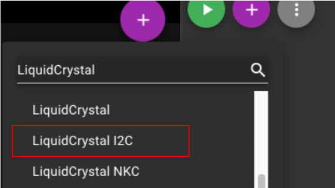  

5. Buatlah rangkaian seperti pada gambar. Hubungkan kaki terminal 1 potensiometer dengan 5 volt, kaki wiper potensiometer dengan A0, kaki terminal 2 dengan ground.
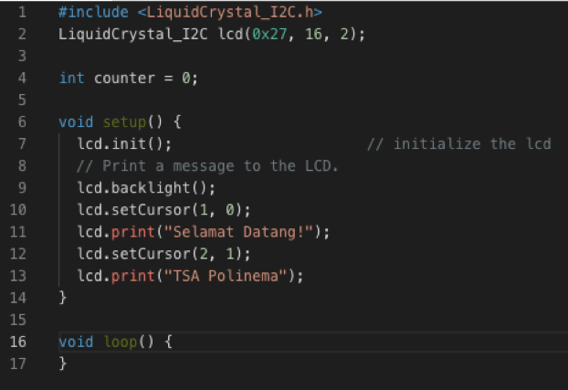

6. Masukkan kode program sesuai dengan gambar dengan klik Code. Ganti mode blocks menjadi mode text.

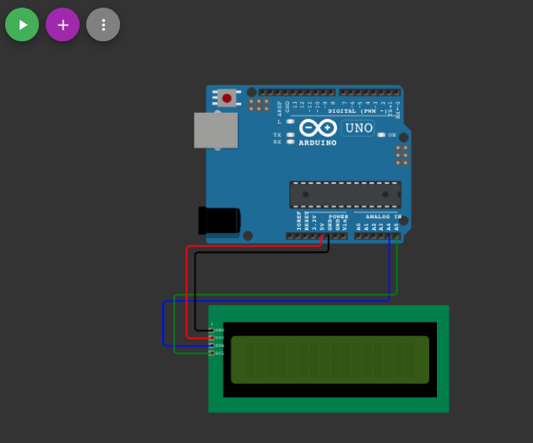

7. Klik Start Simulation untuk memulai simulasi. Klik potensiometer dan ubah dari posisi awal. Klik pada Serial Monitor, maka akan menampilkan nilai PWM sesuai posisi (nilai) potensiometer.
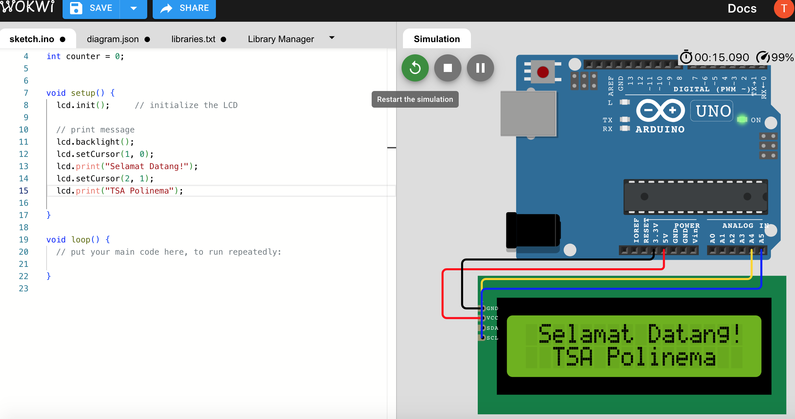


### Praktikum 2: Praktik Pulse Width Modulation(PWM) pada Arduino dengan LED

Selesaikan langkah-langkah praktikum berikut ini menggunakan Tinkercad di browser Anda.

1. Login dengan akun yang sudah dibuat.
2. Klik Design, Circuit
3. Klik Create New Circuit untuk membuat rangkaian baru.
4. Tambahkan Arduino Uno R3 dengan klik Arduino Uno R3 pada bagian Components, lalu klik di bagian simulation space. Tambahkan juga Breadboard Small, Potensiometer, Resistor dan LED.
5. Hubungkan semua seperti gambar.

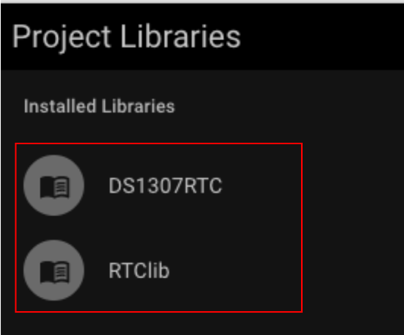
   
6. Masukkan kode program sesuai dengan gambar dengan klik Code. Ganti mode blocks menjadi mode text.

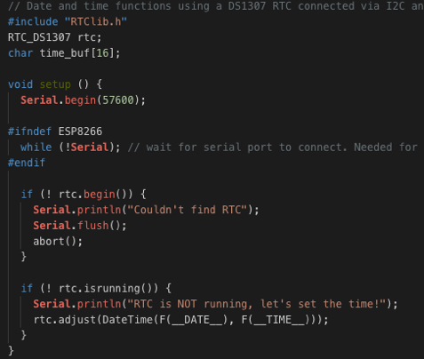

7. Klik Start Simulation untuk memulai simulasi. Klik Potensiometer dan rubah posisinya (merubah nilai). LED akan semakin terang saat nilai potensio berada di kiri. LED semakin redup apabila nilai potensiometer berada di sebelah kanan. Klik Stop Simulation.

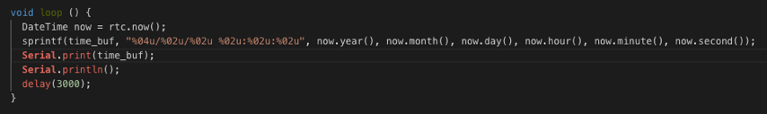

## Praktikum Instalasi IDE(optional)
+ Hubungkan board ESP32 ke PC menggunakan kabel USB. Jika driver perangkat tidak terinstal secara otomatis, identifikasi USB-to-UART bridge pada board ESP32 Anda. Cari driver di internet dan install.
  
  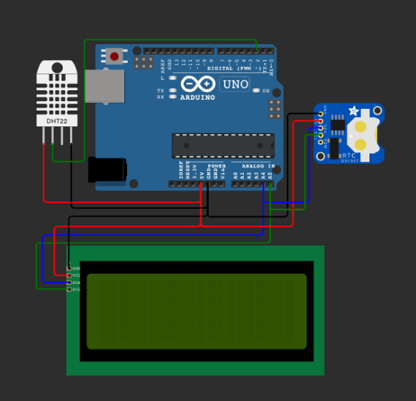
  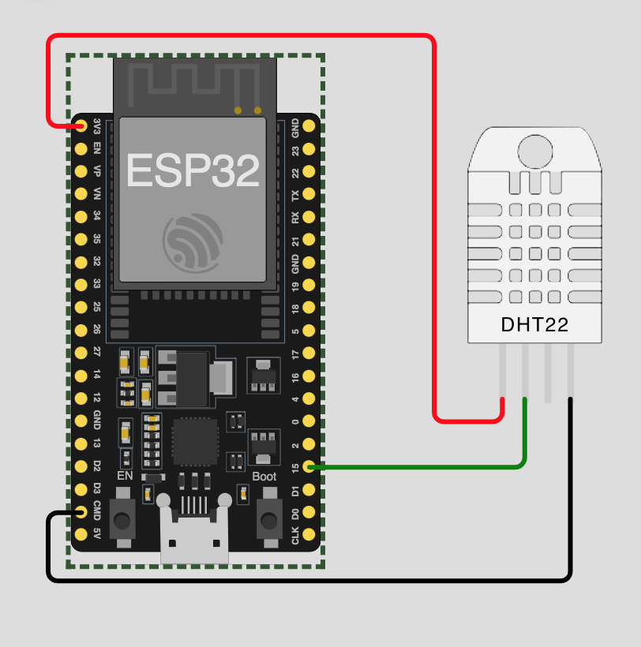
  
+ Jika di Linux atau macOS cek port dengan perintah berikut.
  
  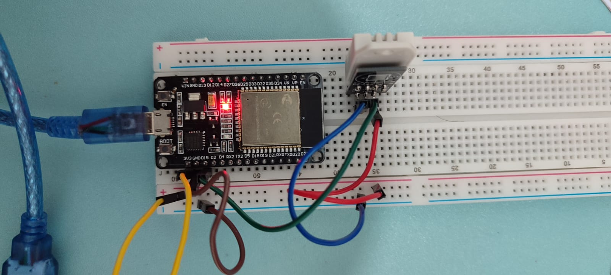
  
+ Download Thonny https://thonny.org/ dan lakukan instalasi.

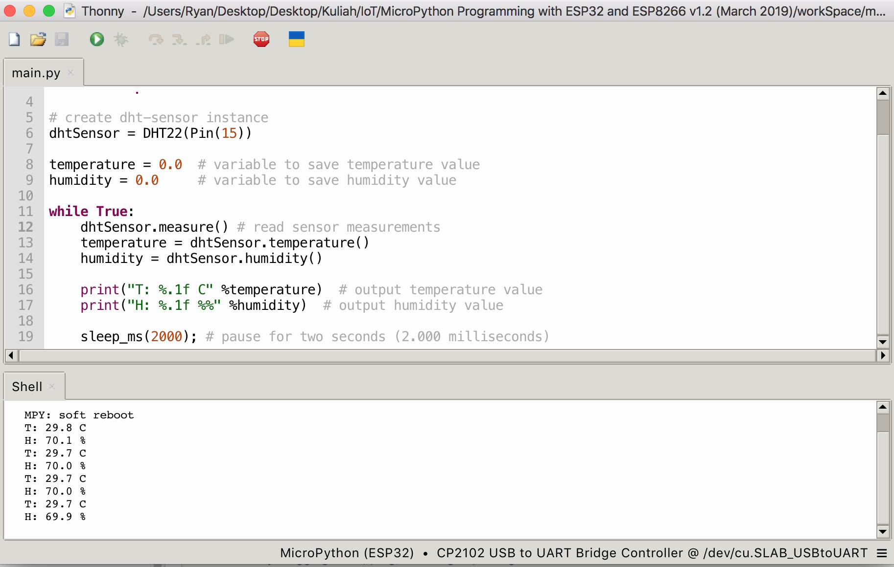
  
+ Setelah selesai instalasi jalankan Thonny, tampilannya seperti gambar di bawah.


## Praktikum Flashing MicroPython Firmware(optional)
+ Kunjungi situs micropython dan download firmware esp32 - https://micropython.org/download/ESP32_GENERIC/


  
+ Hubungkan ESP32 board ke  computer. Buka Thonny IDE. Tools > Options > Interpreter. Pilih Interpreter yang akan digunakan pada board, pilih COM port kemudian pilih Install or Update Firmware.


+ Pilih port sekali lagi. Pilih lokasi firmware yang sudah didownload. Tools > Options > Interpreter. Pilih pengaturan seperti pada gambar dan klik Install.


+ Thonny dan board siap digunakan, bisa dicoba dengan ketik help.


### Praktikum Dasar Menyalakan dan mematikan LED

+ Duplikasi code berikut


+ LED nyala dan mati


### Praktikum PWM Dim LED dengan Micropython

+ Buat skenario seperti gambar


+ Untuk membuat objek PWM, Anda perlu memasukkan parameter, pin yang terhubung dengannya, frekuensi sinyal, dan siklus kerja.

- Frekuensi: Frekuensi dapat berupa nilai antara 0 dan 78125. Frekuensi 5000 Hz dapat digunakan untuk mengontrol kecerahan LED.
-Siklus kerja(Duty cycle): Siklus kerja dapat berupa nilai antara 0 dan 1023. Dimana 1023 menunjukkan siklus kerja 100% (kecerahan penuh), dan 0 menunjukkan siklus kerja 0% (LED tidak menyala).

+ Duplikasi code berikut

```python
from machine import Pin, PWM 
from time import sleep

frequency = 5000
led = PWM(Pin(5), frequency) 

while True:
  for duty_cycle in range(0, 1024):
    led.duty(duty_cycle)
    sleep(0.005)
```

+ Hasilnya seharusnya led berganti tingkat terangnya.
https://www.youtube.com/shorts/FfVE_UA46Eg

  
## Tugas Mandiri 
Selesaikan langkah-langkah praktikum berikut ini menggunakan Tinkercad di browser Anda.

**Tugas 1**
- Tambahkan 1 buah LED. Buatlah program agar nyala kedua LED berlawanan saat potensiometer diubah nilainya.
  
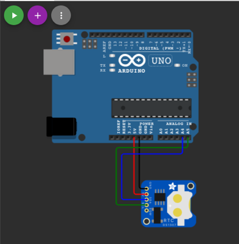

**Tugas 2**
- Lakukan seperti tugas 1, dengan mengubah board ke esp32!
